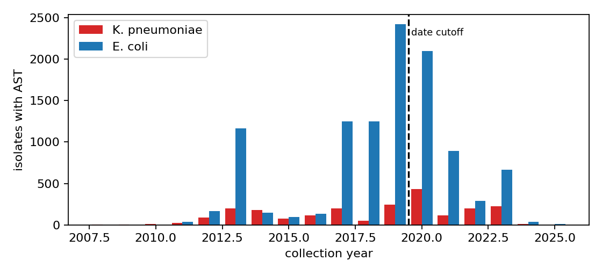
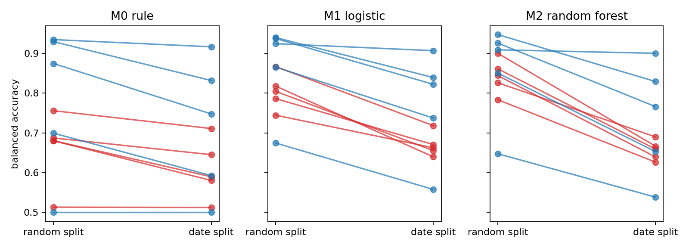
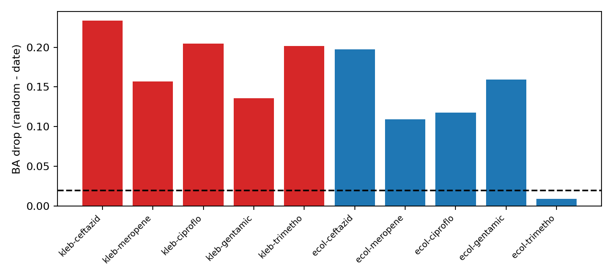
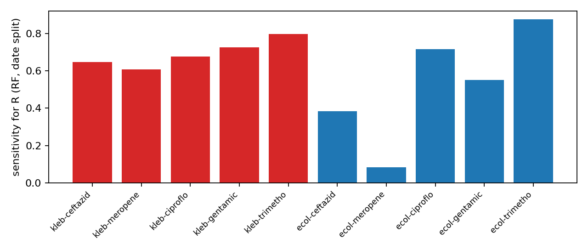
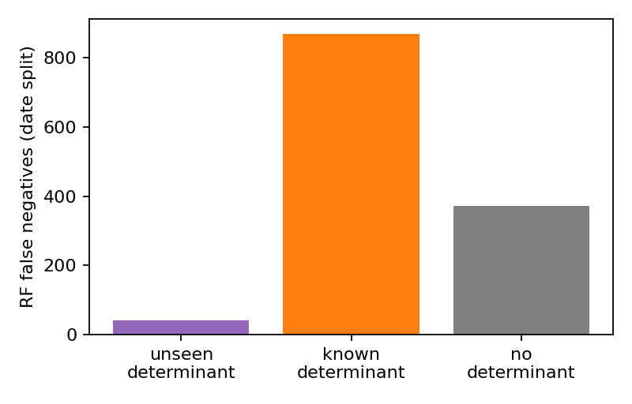
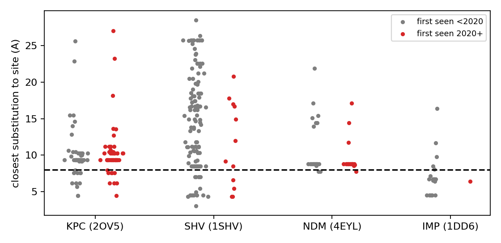

\newpage

# Abstract

**Problem.** Tools that predict antibiotic resistance from a bacterial genome are usually tested on a random slice of the same collection they were built from. Hospitals, however, use them on isolates collected *after* the tool was built. If resistance biology, testing practice, or the mix of strains changes over time, random-split accuracy will overstate real-world accuracy.

**Data.** We assembled 12,841 *Klebsiella pneumoniae* and *Escherichia coli* isolates from NCBI Pathogen Detection that have (i) an AMRFinderPlus genotype, (ii) a laboratory antimicrobial susceptibility test (AST) result for at least one of five drugs, and (iii) a collection year. We added the AMRFinderPlus reference catalog (database 2026-08-07.1), allele protein sequences, and four beta-lactamase crystal structures from RCSB PDB.

**Methods.** Gates were locked in a standalone commit before any model was run. We compared three predictors (a class-level rule, logistic regression, random forest) under a random split and a date split (train on isolates collected up to 2019, test on 2020 onward), with bootstrap confidence intervals. We then classified every date-split miss by cause, tested whether a "novelty" score flags misses, and mapped new beta-lactamase alleles onto protein structures.

**Results.** (1) Accuracy drops on newer isolates in all 20 machine-learning cells: mean balanced accuracy (BA) falls by 0.134 (95% CI 0.109-0.158). The largest drop is ceftazidime in *K. pneumoniae* (random forest, 0.900 to 0.666). (2) Of 1,281 resistant isolates the random forest missed on the date split, only 41 (3.2%) carried a resistance gene the model had never seen; 869 (67.8%) carried a *known* determinant of that drug class, and 371 (29.0%) had no determinant at all. (3) **Negative result:** a pre-registered novelty score did not flag misses (AUROC 0.52, CI 0.51-0.54; gate needed 0.65). (4) **Negative result:** newer beta-lactamase alleles were not enriched for substitutions near the catalytic site (odds ratio 0.80, p = 0.54, exploratory).

**Tool.** From these results we built `amr-ew`, a command-line predictor that reports its *date-split* accuracy instead of the optimistic random-split number, adds per-determinant early-warning flags based on which known genes are missed most often in new isolates, and annotates beta-lactamase alleles with structural distance to the active site.

**Contribution.** A cross-species, date-split benchmark showing that the main reason predictions fail on new isolates is a changed genotype-to-phenotype link for *known* genes, not new genes. This moves the early-warning target away from "watch for new genes" toward "watch for known genes that stop behaving as expected".

\newpage

# Introduction

## The problem

Antimicrobial resistance (AMR) is one of the most serious global health threats. The AMRscope authors summarise estimates of about 700,000 deaths per year, projected to rise sharply by 2050 (AMRscope, bioRxiv 2025 [7]). Doctors often must start antibiotics before laboratory susceptibility results are ready, so fast genome-based prediction could guide the first choice of drug.

Two families of methods exist. **Rule-based** tools such as ResFinder 4.0 [1] and NCBI AMRFinderPlus [2] detect known resistance genes and point mutations and translate them into predicted phenotypes. **Machine-learning (ML)** methods learn the link between genome features and laboratory phenotype from large collections [3, 4, 5].

## Why time matters

Most published evaluations split one collection randomly into training and test sets. Because isolates from the same outbreak, lab and year land on both sides, the test set looks very much like the training set. A deployed tool meets isolates from later years, possibly with new genes, new strain backgrounds, and changed lab breakpoints. The question of this project is simple: **how much accuracy is lost when a genome-based AMR predictor is tested on isolates collected after its training data, and why?**

## Research questions

1. **RQ1 (G1).** Is date-split accuracy lower than random-split accuracy, across species, drugs and models?
2. **RQ2 (G2).** When the model misses a resistant isolate from the new era, is it because of an unseen gene, a known gene, or no detectable gene?
3. **RQ3 (G3).** Can a simple novelty score flag those misses early?
4. **RQ4 (G4).** Do newly appearing beta-lactamase alleles carry substitutions close to the enzyme's active site?
5. **RQ5 (G5).** Can these findings be turned into a practical tool?

# Background and prior art

## Rule-based genotype-to-phenotype prediction

ResFinder 4.0 added phenotype prediction from detected genes and point mutations for several species [1]. The AMRFinder validation study compared tool calls with measured phenotypes on a fixed collection of isolates [2]. A systematic review of AMR marker databases found performance varies widely by drug and species [3]. All of these evaluate on fixed collections, not on isolates collected after the database was built.

## Machine-learning prediction

ML methods predict phenotype from genes, SNPs or k-mers. Recent examples include *E. coli* WGS classifiers trained on 1,952 isolates [4], work on *Acinetobacter baumannii* feature limits [5], and interpretable deep learning for *K. pneumoniae* [6]. VAMPr maps variants to resistance with explainable features [8]. A large community benchmark assessed computational AMR phenotype predictions from genomes [9].

## Novel-variant and surveillance approaches

AMRscope uses protein language model embeddings to score single amino-acid substitutions for resistance risk and tests generalisation with gene, organism and homology hold-outs, but not date hold-outs [7]. DRAMMA detects novel AMR genes in metagenomes [10]. amr.watch monitors AMR trends from global genomic data but does not benchmark phenotype prediction [11]. A PLOS Biology study argued that genotype-based diagnostics need ongoing surveillance to stay sensitive [12].

## Closest prior work: temporal validation

The open-source project `kleb-amr-project` trains *K. pneumoniae* models on pre-2023 isolates and tests on 2023-2024 [13]. That is a single-species temporal test. It does not break down *why* new-era isolates are missed, and it does not test an early-warning signal.

## Gap addressed here

| Aspect | Rule tools [1,2] | AMRscope [7] | amr.watch [11] | kleb-amr-project [13] | **This work** |
|---|---|---|---|---|---|
| Phenotype prediction | yes | variant risk | no | yes | yes |
| Date-split test | no | no | n/a | yes (1 species) | **yes (2 species, 5 drugs, 3 models)** |
| Cause of new-era misses | no | no | no | no | **yes** |
| Early-warning score tested | no | partly | trends | no | **yes (negative)** |
| Structural mapping of new alleles | no | AlphaFold heatmaps | no | no | **yes** |

# Data

## Sources

| Dataset | Content | Source |
|---|---|---|
| NCBI Pathogen Detection PDG000000012.2532 | *K. pneumoniae* isolates, genotypes, AST | ftp.ncbi.nlm.nih.gov/pathogen/Results/Klebsiella |
| NCBI Pathogen Detection PDG000000004.6316 | *E. coli/Shigella* isolates | ftp.ncbi.nlm.nih.gov/pathogen/Results/Escherichia_coli_Shigella |
| AMRFinderPlus DB 2026-08-07.1 | ReferenceGeneCatalog, AMRProt.fa, mutation tables | ftp.ncbi.nlm.nih.gov/pathogen/Antimicrobial_resistance/AMRFinderPlus |
| RCSB PDB | KPC-2 (2OV5), SHV-1 (1SHV), NDM-1 (4EYL), IMP-1 (1DD6) | files.rcsb.org |

Every file's URL and SHA-256 checksum is listed in `data/SOURCES.md`. The NCBI AST data are described in the NCBI Insights post on the AST browser [14].

## Inclusion

An isolate was included if it had an AST result (R/I/S) for at least one of ceftazidime, meropenem, ciprofloxacin, gentamicin, or trimethoprim-sulfamethoxazole, and a four-digit collection year. This gave **12,841 isolates**. Intermediate (I) results were excluded from the primary analysis.

{width=90%}

## Test set sizes (Gate G0)

| Drug | Species | Train n (R) | Test n (R) |
|---|---|---|---|
| ceftazidime | K. pneumoniae | 984 (537) | 733 (224) |
| ceftazidime | E. coli | 1114 (348) | 2487 (593) |
| meropenem | K. pneumoniae | 605 (314) | 486 (143) |
| meropenem | E. coli | 3921 (78) | 2602 (108) |
| ciprofloxacin | K. pneumoniae | 576 (342) | 518 (189) |
| ciprofloxacin | E. coli | 5152 (515) | 2854 (946) |
| gentamicin | K. pneumoniae | 576 (283) | 462 (194) |
| gentamicin | E. coli | 5077 (892) | 2602 (380) |
| trimethoprim-sulfamethoxazole | K. pneumoniae | 558 (333) | 521 (197) |
| trimethoprim-sulfamethoxazole | E. coli | 5037 (716) | 2385 (695) |

All ten drug-species cells passed G0 (at least 100 test isolates and 20 resistant).

# Methods

## Pre-registration

The analysis plan and pass/fail thresholds were committed as `GATES_LOCKED.md` (commit 9f770aa) before any model was trained. Before that commit, raw metadata were downloaded and only counted (isolates per year, tests per drug) to check feasibility; this is disclosed in `DEVIATIONS.md`. No gate threshold was changed after results were seen.

## Features

Each isolate is a presence/absence vector of AMRFinderPlus determinants (genes and point mutations) listed in the `AMR_genotypes` field. The vocabulary is built from the training set only, so a determinant first seen after the cutoff is invisible to the model.

## Models

- **M0, class-level rule:** predict R if the isolate carries any determinant whose AMRFinderPlus subclass matches the drug's class (both a trimethoprim and a sulfonamide determinant for trimethoprim-sulfamethoxazole).
- **M1:** L2-regularised logistic regression.
- **M2:** random forest, 500 trees, seed 42.

## Splits and statistics

- **Random split:** stratified 80/20.
- **Date split:** train on collection year up to 2019, test on 2020 onward.
- Primary metric: balanced accuracy (BA), the mean of sensitivity and specificity. Secondary: Matthews correlation coefficient (MCC) and sensitivity for resistance.
- 95% confidence intervals from 1,000 bootstrap resamples.
- G1 passes if the mean BA drop across ML cells is at least 0.02 and its CI excludes zero.

## Error anatomy (G2)

Each date-split false negative (resistant isolate called susceptible by M2) was assigned to one category: (a) carries a determinant of the drug's class that was absent from the training vocabulary; (b) carries only known determinants of the class; (c) carries no determinant of the class.

## Novelty score (G3)

Score = number of determinants unseen before the cutoff + 2 x number of unseen determinants of the drug's class. Gate: AUROC for separating missed from caught resistant isolates of at least 0.65 with CI lower bound above 0.5.

## Structural layer (G4)

For four beta-lactamase families, each allele's protein sequence (AMRProt.fa) was aligned (Biopython, BLOSUM62) to its family reference (KPC-2, SHV-1, NDM-1, IMP-1), and the reference to the PDB chain. For every substitution we computed the minimum heavy-atom distance from the substituted residue to the catalytic site: the Ser70 side-chain oxygen for class A enzymes (verified as residue SER 70 in both structures) or any zinc ion for metallo-beta-lactamases. "Proximal" means 8 Angstrom or closer. An allele's first year is the earliest collection year it appears in the two PDG snapshots.

# Results

## RQ1: accuracy falls on newer isolates (G1 PASS)

{width=100%}

Across the 20 ML cells the mean BA drop was **0.134 (95% CI 0.109-0.158)**. Every cell dropped. The near-null exception was trimethoprim-sulfamethoxazole in *E. coli* (random forest drop 0.009), where accuracy stayed near 0.90.

| Species | Drug | Model | BA random | BA date | Drop |
|---|---|---|---|---|---|
| K. pneumoniae | ceftazidime | M1 | 0.867 | 0.718 | +0.148 |
| K. pneumoniae | ceftazidime | M2 | 0.900 | 0.666 | +0.233 |
| K. pneumoniae | meropenem | M1 | 0.744 | 0.663 | +0.082 |
| K. pneumoniae | meropenem | M2 | 0.783 | 0.626 | +0.157 |
| K. pneumoniae | ciprofloxacin | M1 | 0.817 | 0.640 | +0.178 |
| K. pneumoniae | ciprofloxacin | M2 | 0.844 | 0.640 | +0.204 |
| K. pneumoniae | gentamicin | M1 | 0.804 | 0.655 | +0.149 |
| K. pneumoniae | gentamicin | M2 | 0.826 | 0.690 | +0.136 |
| K. pneumoniae | TMP-SMX | M1 | 0.786 | 0.671 | +0.116 |
| K. pneumoniae | TMP-SMX | M2 | 0.861 | 0.659 | +0.202 |
| E. coli | ceftazidime | M1 | 0.865 | 0.737 | +0.128 |
| E. coli | ceftazidime | M2 | 0.850 | 0.653 | +0.197 |
| E. coli | meropenem | M1 | 0.674 | 0.558 | +0.117 |
| E. coli | meropenem | M2 | 0.647 | 0.538 | +0.109 |
| E. coli | ciprofloxacin | M1 | 0.939 | 0.839 | +0.100 |
| E. coli | ciprofloxacin | M2 | 0.947 | 0.829 | +0.118 |
| E. coli | gentamicin | M1 | 0.937 | 0.822 | +0.115 |
| E. coli | gentamicin | M2 | 0.926 | 0.766 | +0.160 |
| E. coli | TMP-SMX | M1 | 0.924 | 0.907 | +0.018 |
| E. coli | TMP-SMX | M2 | 0.909 | 0.900 | +0.009 |

{width=90%}

A notable pattern: the random forest, which looks best on random splits, often loses the most on the date split. In *K. pneumoniae* ceftazidime, logistic regression beats the forest on new isolates (0.718 vs 0.666). More flexible models appear to fit period-specific patterns.

### Date-split detail for the random forest

| Species | Drug | BA (95% CI) | MCC | Sensitivity for R |
|---|---|---|---|---|
| K. pneumoniae | ceftazidime | 0.666 (0.629-0.701) | 0.311 | 0.647 |
| K. pneumoniae | meropenem | 0.626 (0.578-0.672) | 0.233 | 0.608 |
| K. pneumoniae | ciprofloxacin | 0.640 (0.595-0.680) | 0.269 | 0.677 |
| K. pneumoniae | gentamicin | 0.690 (0.649-0.732) | 0.375 | 0.727 |
| K. pneumoniae | TMP-SMX | 0.659 (0.618-0.697) | 0.315 | 0.797 |
| E. coli | ceftazidime | 0.653 (0.634-0.672) | 0.365 | 0.383 |
| E. coli | meropenem | 0.538 (0.514-0.568) | 0.157 | 0.083 |
| E. coli | ciprofloxacin | 0.829 (0.813-0.845) | 0.694 | 0.715 |
| E. coli | gentamicin | 0.766 (0.742-0.793) | 0.639 | 0.550 |
| E. coli | TMP-SMX | 0.900 (0.885-0.913) | 0.786 | 0.876 |

{width=90%}

The weakest cell is *E. coli* meropenem: only 78 resistant isolates in training, and sensitivity of 8% on new isolates. A carbapenem-resistant *E. coli* would usually be called susceptible, the most dangerous error.

### Honest negative on the rule baseline

The locked class-level rule (M0) collapsed to BA near 0.50 for *E. coli* ceftazidime and *K. pneumoniae* ciprofloxacin. The reason is that intrinsic chromosomal genes (such as *blaEC* in *E. coli* and *oqxAB* in *K. pneumoniae*) carry the drug-class label in the catalog, so the rule calls nearly everything resistant. We kept the rule as locked and report this: class-level rules that ignore intrinsic genes are not a fair baseline for these cells, and practical rule tools [1, 2] use curated drug-specific logic.

## RQ2: new-era misses are mostly known genes (G2)

{width=65%}

| Category | Count | Share |
|---|---|---|
| (a) unseen determinant of the drug class | 41 | 3.2% |
| (b) known determinant of the drug class | 869 | 67.8% |
| (c) no determinant of the drug class | 371 | 29.0% |

This is the main finding. **New genes are not the main problem.** Two thirds of the missed resistant isolates carry genes the model had already seen. The model had learned from pre-2020 data that those genes were not enough to predict resistance, but in newer isolates they were. Possible reasons include changes in the genetic background, gene expression or copy number, lab methods, or the breakpoints used to call R and S. Our data cannot separate these; the per-isolate testing standard was not in the metadata we used. The 29% with no determinant point to mechanisms outside the AMRFinderPlus catalog (for example porin loss or efflux upregulation without a catalogued mutation).

## RQ3: a novelty score does not flag misses (G3 FAIL, negative kept)

The novelty score gave **AUROC 0.522 (95% CI 0.507-0.536)** across 3,669 resistant test isolates (1,281 missed). The gate needed 0.65. This follows from RQ2: if only 3% of misses involve unseen genes, counting unseen genes cannot find the other 97%. We did not re-tune the score.

## RQ4: structural analysis of new beta-lactamase alleles (G4, descriptive)

Only five alleles first seen in 2020 or later appear in date-test isolates, below the n of 10 needed for the locked Fisher test, so they are described:

| Allele | First year in PDG | Substitutions vs reference (distance to site, A) | Closest (A) | In a missed isolate |
|---|---|---|---|---|
| blaKPC-45 | 2020 | T92K (23.2) | 23.2 | no |
| blaSHV-57 | 2024 | L165R (6.6) | 6.6 | no |
| blaSHV-250 | 2022 | Y3F (signal peptide), G232E (5.4) | 5.4 | no |
| blaNDM-50 | 2022 | M22I (signal region), D130N (17.1), M154L (8.8) | 8.8 | **yes** |
| blaIMP-18 | 2020 | 48 substitutions (distant IMP homolog) | 6.4 | no |

"First year" means first appearance in this surveillance stream, not the year of first publication; some alleles were described earlier (see DEVIATIONS.md).

{width=90%}

**Exploratory (not pre-registered):** across all 338 alleles with substitutions in the four families, 16 of 101 post-2019 alleles and 45 of 237 earlier alleles had a substitution within 8 A of the site (OR 0.80, p = 0.54). **Negative:** newer alleles are not more active-site-focused. KPC is the fastest-diversifying family in this stream: 64 of 125 KPC alleles were first seen in 2020 or later.

# The tool: amr-ew

Each design choice in the tool comes from a result:

| Result | Design choice in amr-ew |
|---|---|
| G1: random-split accuracy is optimistic by 0.13 BA | Each call reports the model's *date-split* BA for that drug and species |
| G2: 68% of misses carry known genes | Early-warning flag when a carried determinant was missed in 30% or more of resistant 2020+ isolates |
| G3: novelty does not predict misses | Unseen determinants are listed as information only, never as a confidence score |
| G4: structural distance is informative per allele but not a group signal | Per-allele distance to active site reported for KPC, SHV, NDM, IMP |

Example:

```
python3 tool/amr_ew.py --species klebsiella --year 2023 \
  --genotypes "blaKPC-2,blaSHV-11,gyrA_S83I,parC_S80I"
```

Output (JSON) gives, per drug: R/S call, probability, honest date-split BA, and early-warning messages.

**Validation (G5).** On 30 random 2020+ isolates (seed 42) the tool made 77 drug calls with 0.870 accuracy. All 7 missed resistant calls carried an early-warning flag, but so did 6 of 9 correct resistant calls. The flags were derived on the same test period, so this is in-sample and optimistic. The flags are sensitive but not specific. We report this as a limitation, not a validated early-warning claim.

# Discussion

## What this means

A genome-based AMR model that reports 0.90 balanced accuracy on a random split may deliver about 0.67 on isolates from the following years. Anyone deploying such a model should ask for date-split numbers. Our benchmark gives a reusable way to produce them from public NCBI data.

The error anatomy changes where early warning should look. Surveillance systems often focus on new genes and new alleles [10, 11]. In our data those explain only 3% of misses. The larger signal is a known gene whose link to phenotype changes. A practical early-warning system should track, for each known determinant, the rate at which carriers test resistant, and alarm when that rate shifts. This matches the argument that genotype-based diagnostics need continuous surveillance to stay sensitive [12].

## Comparison with prior art

- Versus **kleb-amr-project** [13]: we extend temporal validation to two species and three model types, and add the cause-of-miss breakdown.
- Versus **AMRscope** [7]: AMRscope's hold-outs are by gene, organism and homology; ours is by date, the axis a deployed tool actually faces. Our structural negative suggests that position near the active site alone does not mark newer alleles.
- Versus **rule tools** [1, 2]: our naive class rule failed where intrinsic genes exist, a reminder that rule tools depend on careful drug-specific curation.

**Quantified methodological contribution.** On identical isolates and features, a random-split benchmark overstates new-isolate balanced accuracy by 0.134 on average (up to 0.233). The error decomposition shows that 96.8% of new-era misses are not addressable by novelty detection, the approach behind novel-gene early-warning tools.

## Limitations

1. Isolates in NCBI Pathogen Detection with AST are not a random sample of infections; many come from US surveillance and a few large projects.
2. We used AMRFinderPlus calls as features and did not re-assemble genomes; SNP and k-mer features might behave differently.
3. The cause of the known-gene shift (breakpoints, labs, strain background) could not be separated with the metadata used.
4. Only one cutoff (2019/2020) was tested, as locked.
5. The tool's early-warning flags are validated in-sample only.
6. Structural analysis used crystal structures of reference enzymes, not models of each allele.

## Future work

Add the per-isolate testing standard to test the breakpoint explanation; add rolling cutoffs; include AlphaFold models per allele; and test determinant-level drift alarms prospectively on isolates released after this snapshot.

# Conclusion

Genome-based AMR prediction loses substantial accuracy on newer isolates in every drug and species tested. The loss comes mainly from known resistance genes whose relation to the measured phenotype shifts, not from new genes. Two pre-registered ideas failed and are reported: a novelty score does not flag misses, and newer beta-lactamase alleles are not enriched near the active site. The `amr-ew` tool turns these results into honest per-drug accuracy reporting and determinant-level warnings.

# Reproducibility

- Code: `code/build_dataset.py`, `code/analysis.py`, `code/structural_layer.py`, `code/figures.py`, `tool/amr_ew.py`, `tool/validate_tool.py`.
- Results: `results/` (JSON, TSV, markdown gate reports).
- Gates: `GATES_LOCKED.md` (commit 9f770aa); deviations: `DEVIATIONS.md`.
- Every committed file is listed with its SHA-256 in `MANIFEST.sha256`.
- Software: Python 3, scikit-learn 1.7.2, Biopython 1.88, SciPy, matplotlib. Random seed 42 throughout.

# References

1. Bortolaia V. et al. ResFinder 4.0 for predictions of phenotypes from genotypes. https://pmc.ncbi.nlm.nih.gov/articles/PMC7662176/
2. Feldgarden M. et al. Validating the AMRFinder tool and resistance gene database by using antimicrobial resistance genotype-phenotype correlations in a collection of isolates. Antimicrob Agents Chemother. https://journals.asm.org/doi/10.1128/aac.00483-19
3. Large-scale assessment of antimicrobial resistance marker databases for genetic phenotype prediction: a systematic review. https://pmc.ncbi.nlm.nih.gov/articles/PMC7566382/
4. Utilizing whole genome sequencing data for machine learning prediction of resistance in E. coli. Front Microbiol 2026. https://www.frontiersin.org/journals/microbiology/articles/10.3389/fmicb.2026.1842717/full
5. Exploring feature limitations in antimicrobial resistance prediction: machine learning and deep learning in A. baumannii. Sci Rep 2026. https://doi.org/10.1038/s41598-026-57632-w
6. Harnessing interpretable deep learning to predict resistance in Klebsiella pneumoniae. Front Cell Infect Microbiol 2026. https://www.frontiersin.org/journals/cellular-and-infection-microbiology/articles/10.3389/fcimb.2026.1859508/full
7. Risk-Based Prediction of Novel AMR Variants Using Protein Language Models (AMRscope). bioRxiv 2025. https://www.biorxiv.org/content/10.1101/2025.09.12.672331v1.full-text
8. VAMPr: VAriant Mapping and Prediction of antibiotic resistance via explainable features and machine learning. PLOS Comput Biol. https://journals.plos.org/ploscompbiol/article?id=10.1371%2Fjournal.pcbi.1007511
9. Assessing computational predictions of antimicrobial resistance phenotypes from microbial genomes. https://pubmed.ncbi.nlm.nih.gov/38706320/
10. DRAMMA: a multifaceted machine learning approach for novel antimicrobial resistance gene detection in metagenomic data. Microbiome. https://link.springer.com/article/10.1186/s40168-025-02055-4
11. Monitoring antimicrobial resistance trends from global genomics data: amr.watch. PLOS Glob Public Health 2025. https://journals.plos.org/globalpublichealth/article?id=10.1371%2Fjournal.pgph.0005256
12. Surveillance to maintain the sensitivity of genotype-based antibiotic resistance diagnostics. PLOS Biol. https://journals.plos.org/plosbiology/article/file?id=10.1371%2Fjournal.pbio.3000547&type=printable
13. NasirNesirli. kleb-amr-project (temporal validation of K. pneumoniae AMR prediction). https://github.com/NasirNesirli/kleb-amr-project
14. NCBI Insights. NCBI Pathogen Detection presents the Antibiotic Susceptibility Test browser (2024). https://ncbiinsights.ncbi.nlm.nih.gov/2024/05/01/pathogen-detection-ast-browser/
15. RCSB Protein Data Bank entries 2OV5, 1SHV, 4EYL, 1DD6. https://www.rcsb.org/
16. NCBI Pathogen Detection data (PDG000000012.2532, PDG000000004.6316) and AMRFinderPlus database 2026-08-07.1. https://ftp.ncbi.nlm.nih.gov/pathogen/
